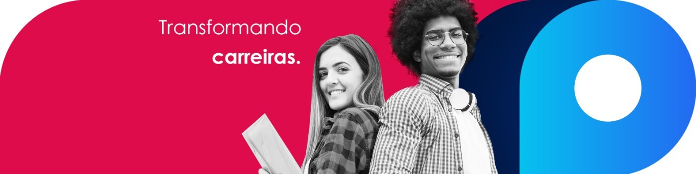

# Data Jobs

## What we do?

- We help
  people [transform their lives through education](https://blog.provi.com.br/institucional/provi-fintech-acesso-a-educacao/)
- We help
  people [to do a course them have always dreamed with but was never being able to pay for it](https://6minutos.uol.com.br/minhas-financas/conheca-a-provi-a-fintech-que-analisa-sua-perspectiva-de-carreira-na-hora-de-emprestar/)
- We
  help [medical students finish their graduation with allowance](https://forbes.com.br/forbes-tech/2020/07/fintech-e-plataforma-de-educacao-anunciam-programa-para-estudantes-de-medicina/)
- We help
  people [to study without paying until they get a job](https://medium.com/@avbaraldi/o-que-%C3%A9-income-share-agreement-isa-1539eb015267)
- We build **high scalable microservices** so our students and partners have an amazing experience from beginning to
  finish
